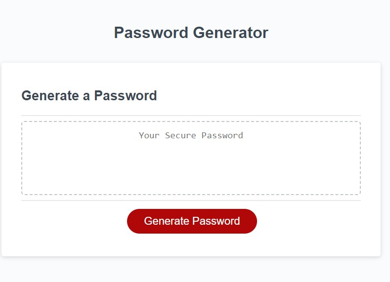

# Password Generator

A password generator to create a strong password to secure sensitive data by randomly generating a password that meets certain criteria for example: uppercase, lowercase, numeric, and special characters.

This app will run in the browser and will feature dynamically updated HTML and CSS powered by JavaScript code that you write. It will have a clean and polished, responsive user interface that adapts to multiple screen sizes.

https://frannyp71.github.io/challenge-3-pw-gen/

